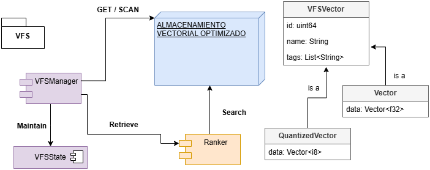

# VFS

VFS es un motor de búsquedas y almacenamiento de vectores escrito en Rust. Empecé a desarrollarlo inspirado por el curso de Carnegie Mellon University Database Group: `Introduction to Database Systems (2025)`

En este curso, Andy Pavlo explica muy detalladamente como funcionan los detalles intrínsecos de los principales motores de almacenamiento que conocemos en la industria. Aunque no se centra específicamente en bases de datos vectoriales, muchas de las técnicas que él explica las he aplicado para desarrollar el proyecto (cache buffer, carga de datos por lotes, índices).

VFS no es ni pretende ser una base de datos vectorial empleada en entornos productivos en ningún caso. Se trata de un proyecto personal orientado a mejorar mi entiendimiento de los sistemas basados en búsqueda vectorial.

# Arquitectura de VFS

* **VFSManager**: es el principal orquestador del motor de almacenamiento. Mantiene el estado del sistema, el cual se guarda periódicamente en disco para evitar la pérdida de datos. Además, es el somponente encargado de cargar vectores en memoria a través de una caché que se va actualizando de forma dinámica, adaptándose a las peticiones del usuario.

* La struct **VFSVector** es otro componente muy importante. Es la principal abstracción de un vector en VFS. Puede contruirse desde un vector Rust (`Vec`) o un vector SIMD (`Simd`), y tiene dos implementaciones posibles:
    - **QuantizedVector**: vector cuantizado y comprimido, más eficiente en entornos limitados.
    - **Vector**: vector de `float32`.

* El módulo **Ranker** es el principal motor de búsquedas. Soporta búsqueda lineal y aproximada. La segunda usa el algoritmo de Hierarchical Navigable Small Worlds, característico de otras bases de datos vectoriales como `Pinecone` o `Qdrant`. Esto permite realizar búsquedas de similitud con mucha precisión incluso aunque el número de vectores almacenados sea elevado. Las medidas de distancia soportadas son:
    - `Euclidean`: distancia euclídea.
    - `Cosine`: distancia coseno.
    - `SimdEuclidean`: euclídea con operaciones SIMD.
    - `SimdCosine`: coseno con operaciones SIMD.

# Características principales:

* **Búsqueda Exacta y Aproximada**: Soporta tanto búsquedas exactas como aproximadas para adaptarse a diferentes necesidades y balances entre precisión y rendimiento.​ Para la búsqueda exacta se usa un mecanismo de ordenamiento de datos por lotes, mientras que para la búsqueda aproximada, se usa el algoritmo `HNSW: Hierarchical Navigable Small World`.

* **Procesamiento por Lotes**: Incluye un buffer pool en memoria integrado y parametrizable para procesar vectores por lotes, permitiendo realizar búsquedas exactas en datasets gigantescos.

* **Operaciones SIMD (Single Instruction, Multiple Data)**: Permite realizar operaciones vectoriales de una forma optimizada usando una feature experimental de `Rust`; la librería `core::Simd` (disponible en `nightly`).

* **Almacenamiento Flexible**: Permite la gestión de vectores en memoria y en disco, adaptándose a diferentes requisitos de almacenamiento y rendimiento.​ Soporta diferentes niveles de precisión, permitiendo almacenar vectores de `float32` para sistemas que requieren una mayor precisión, o vectores cuantizados de `int8`, para aquellos sistemas más limitados en cuanto a recursos se refiere.

VFS es un proyecto en desarrollo activo, y se agradece cualquier contribución o sugerencia para mejorar sus funcionalidades y rendimiento.
