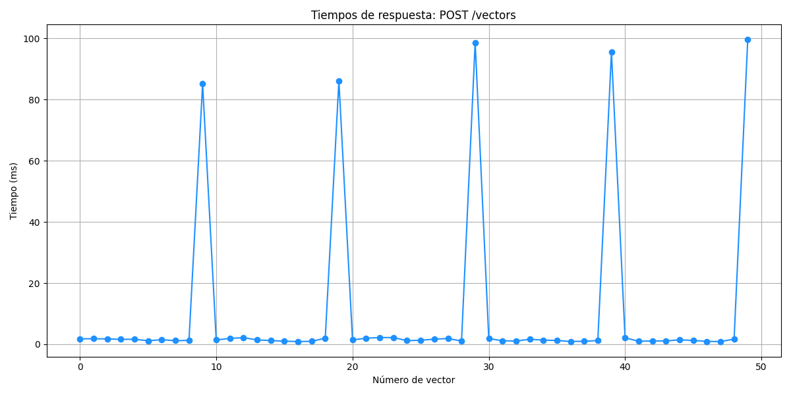
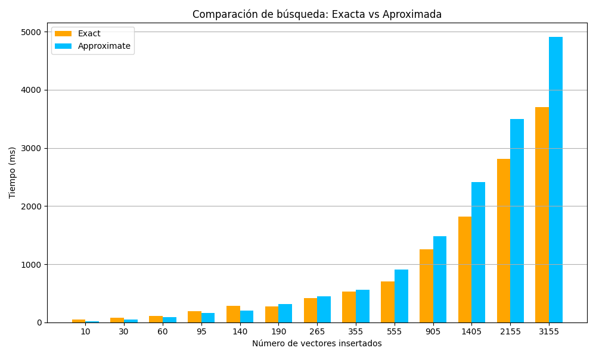
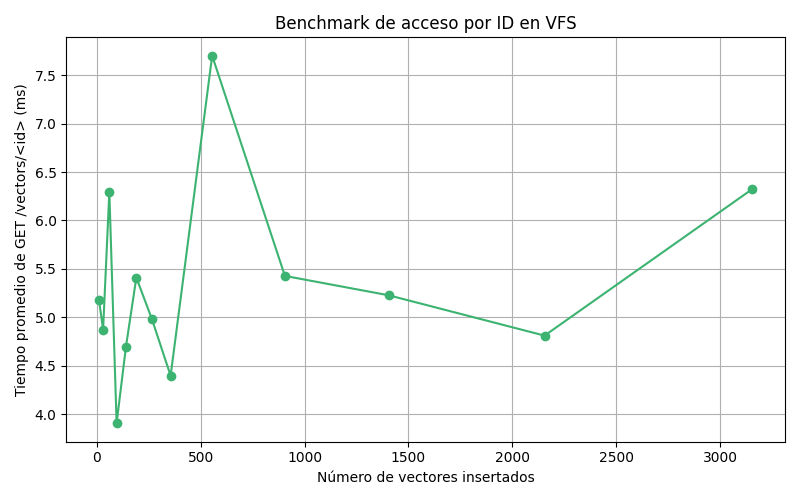

# Documentación de los benchmarks de VFS.

Este repositorio contiene un script en Python diseñado para medir el rendimiento del sistema VFS en diferentes operaciones de su API REST: inserción (POST), búsqueda (SEARCH) y acceso por ID (GET). Los benchmarks permiten evaluar tiempos de respuesta a medida que crece el volumen de vectores indexados.

## Requisitos
- Python 3.7+
- Servidor VFS corriendo en ```http://127.0.0.1:9001```
- Dependencias instaladas:
```bash
pip install requests matplotlib
```
## Como ejecutar
Una vez cumplidos los requisitos, simplemente ejecutar:

```bash
python3 -m benchmarks --benchmark [GET | POST | SEARCH]
```

## ¿Qué mide cada benchmark?

1. **POST** → Inserción de vectores

- **Objetivo**: Medir el tiempo de respuesta al insertar vectores en el sistema, uno por uno.

- **Lo que hace**: Inserta 500 vectores con datos aleatorios. Mide y grafica el tiempo de cada inserción individual.

- **Ejemplo**: Como se ve en la imagen, cada 10 vectores hay un pico de latencia, esto se debe a que los primeros 10 vectores se almacenan en la memtable, pero debido a la configuración de VFSManager, se hace un flush a disco en el vector 10 para evitar llenar la memoria.




2. **SEARCH** → Búsqueda exacta vs aproximada

- **Objetivo**: Comparar los tiempos de búsqueda exacta vs aproximada sobre distintas cantidades de vectores almacenados.

- **Lo que hace**: Inserta vectores progresivamente (acumulativo). Ejecuta una búsqueda con un vector aleatorio usando ambos modos (exact y approximate). Grafica el tiempo comparativo por cada tamaño del sistema.

- **Ejemplo**: La búsqueda exacta tiene una mayor latencia al inicio, pero para un número grande de vectores es más eficiente que la búsqueda aproximada. Puede deberse a utilizar un valor pequeño del parámetro `ef_construction` y al procesamiento por lotes implementado.



3. **GET** → Acceso por identificador

- **Objetivo**: Medir el tiempo promedio de recuperación de vectores existentes usando su ID.

- **Lo que hace**: Inserta N vectores (de forma acumulativa). Realiza múltiples peticiones GET a IDs aleatorios ya insertados.Calcula el tiempo promedio de respuesta para cada conjunto.

- **Ejemplo**: En esta imagen se observa que parece haber un pequeño cuello de botella al pasar a 500 vectores, pero luego se estabiliza, gracias a la indexación.


